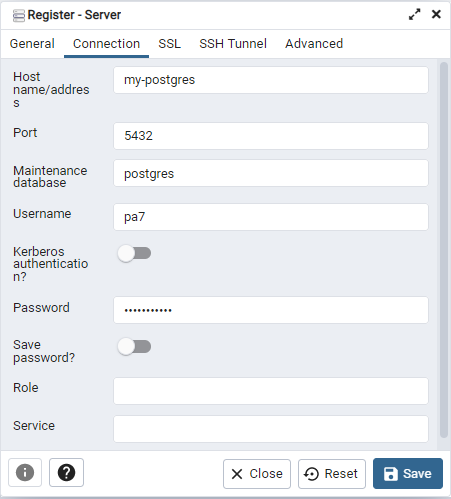
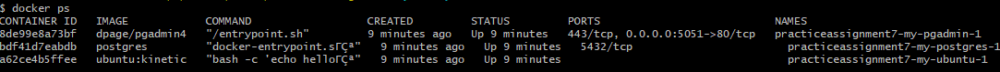

Create a docker-compose file with three services (containers). Name them `my-ubuntu`, `my-postgres`, and `my-pgadmin`.


### my-ubuntu
The first one, `my-ubuntu`, should start from the image `ubuntu`, tag `kinetic` (reminder: the Docker notation for that is `ubuntu:kinetic`).

It should run the following command once it's started:

	bash -c "echo hello && tail -f /dev/null"

To have a container run a command once it's started, you use the `command:` key, followed by the command you want as an argument. You can use the docker-compose file inside the `frontend-and-database` project as reference for this.

There is no need to expose any ports or mount and volumes for this container.

This container will just be an Ubuntu container that does nothing in particular.


### my-postgres
The second one, `my-postgres`, should start from the image `postgres`.

Mount two volumes:

- The first one will have source `./init.sql` and target `/docker-entrypoint-initdb.d/init.sql`
- The second one will have source `./data` and target `/data`

There is no need for any port mappings because we will not be using this container from our host machine. *The database in this container will be used from another container*! Since these three containers are in the same package, they're able to communicate with each other by only using their names.

The restart policy should be `unless-stopped`.

Finally, add three environment variables to the container. You're encouraged to read up on environment variables, but since we haven't covered environment variables in Docker and the environment key in yml, you can just paste this inside this container's definition:

```yml
environment:
    POSTGRES_USER: pa7
    POSTGRES_PASSWORD: pa7password
    PGDATA: /data
```


### my-pgadmin
The third one, `my-pgadmin`, should start from the image `dpage/pgadmin4`.

Create a port mapping for `5051` on the host and `80` in the container.

Restart policy should be `unless-stopped`.

Finally, add two environment variables to the container. You're encouraged to read up on environment variables, but since we haven't covered environment variables in Docker and the environment key in yml, you can just paste this inside this container's definition:

```yml
environment:
    PGADMIN_DEFAULT_EMAIL: pa7@pa7.se
    PGADMIN_DEFAULT_PASSWORD: pa7password
```


---


Once you've properly written the docker-file, just running `docker compose up` will create the three containers and they will run on their own.

The `my-ubuntu` container doesn't serve or do anything useful.

The `my-postgres` container serves a PostgreSQL database with one table.

The `my-pgadmin` contianer serves an instance of pgAdmin, which you can access on localhost:5051. You can log in to pgAdmin using the email and password from the environment variables in the `my-pgadmin` container (`pa7@pa7.se` and `pa7password`).

Once you're inside pgAdmin, you can make a new db connection to the Postgres database inside the previous container.

So far, we've been using a standalone installation of pgAdmin on your host computer, connecting to a Postgres database through `localhost`. Now we're running pgAdmin inside a container, and we're going to connect to a Postgres database inside another container, through the container's name. That means that instead of `localhost`, you will use '`my-postgres`' as the `Host name/address` when registering the Server in pgAdmin. The port is still 5432, because that's where the Postgres database is served, and the username and password are the `POSTGRES_USER` and `POSTGRES_PASSWORD` environment variables in `my-postgres`: `pa7` and `pa7password`.






